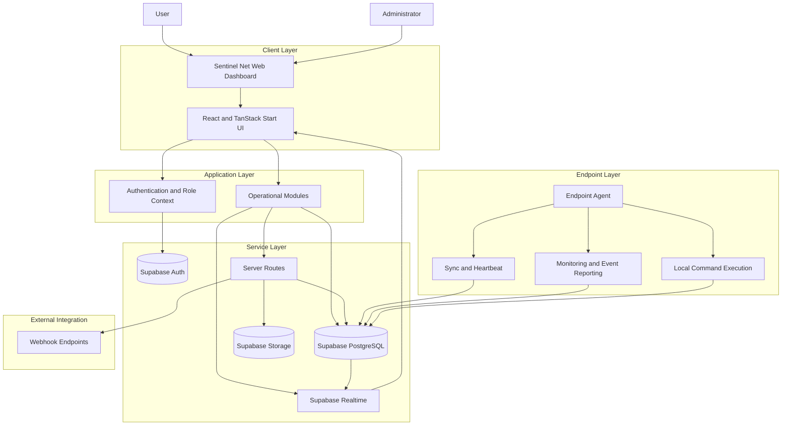
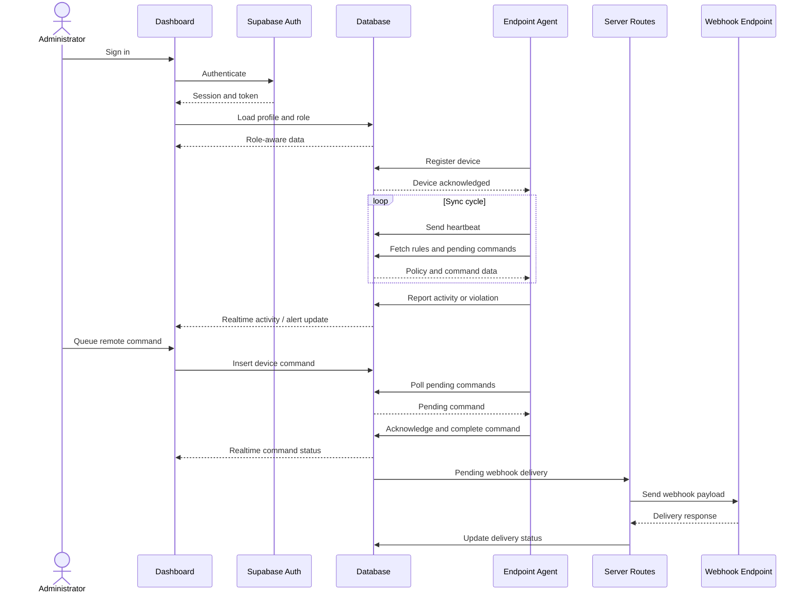
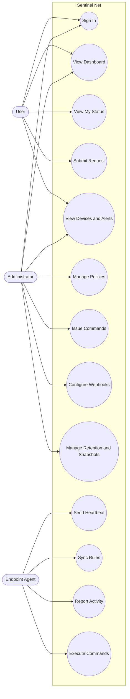
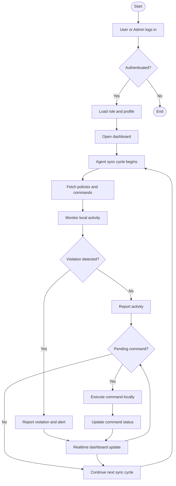

# Sentinel Net

## Real-Time Endpoint Monitoring, Control and Alerting System

## Submitted By

- Name: ____________________
- Registration No: ____________________
- Department: BSSE / IT
- Session / Semester: ____________________

## Submitted To

- Department of Software Engineering / Information Technology
- University / Institute: ____________________

## Supervisor

- Name: ____________________
- Designation: ____________________

---

## Certificate

This is to certify that the project report titled **Sentinel Net: Real-Time Endpoint Monitoring, Control and Alerting System** has been prepared in accordance with the prescribed format and is based on work completed under the supervision of the concerned instructor. The report presents the design and implementation of a centralized monitoring dashboard integrated with endpoint-agent workflows for device visibility, policy management, alert handling, telemetry reporting, and administrative control.

- Supervisor Signature: ____________________
- Date: ____________________

## Declaration

I hereby declare that this documentation is based on the project work carried out for Sentinel Net and that, to the best of my knowledge, it is original. All references, technical resources, and supporting materials used in the preparation of this report have been properly acknowledged.

## Acknowledgement

I would like to express my sincere gratitude to my supervisor, teachers, and department for their guidance and support throughout the development of this project. Their advice and feedback helped improve both the implementation and the presentation of Sentinel Net. I am also thankful to my family and colleagues for their encouragement during the completion of this work.

## Abstract

Sentinel Net is a lightweight centralized endpoint monitoring and control platform designed for managed environments such as academic labs, institutional networks, and office systems. The platform combines a web-based administrative dashboard with a device-side agent model to provide real-time visibility into device status, security events, user activity, and policy compliance. The system supports device registration, alert management, activity logging, telemetry reporting, policy scheduling, request handling, remote command execution, webhook notifications, backup snapshots, and screenshot-retention operations.

The current implementation is built with React, TanStack Start, TypeScript, Tailwind CSS, and Supabase. Supabase provides authentication, relational storage, real-time updates, storage buckets, and server-side service-role operations. The system demonstrates how a modern full-stack web architecture can be used to build a practical monitoring solution that balances control, auditability, extensibility, and operational simplicity.

**Keywords:** endpoint monitoring, security dashboard, agent telemetry, policy enforcement, device control, Supabase, React, alerts

## Preface

This report documents the design, implementation, and operational workflow of Sentinel Net. The report is organized into academic project-report chapters covering the problem background, requirements, design approach, implementation details, system working, diagrams, and future work. The objective is to provide both technical clarity and professional documentation quality for academic evaluation and future project extension.

## Table of Contents

1. Chapter 1: Introduction
2. Chapter 2: Software Requirement Specification
3. Chapter 3: System Analysis and Existing Gap
4. Chapter 4: Software Design Specification
5. Chapter 5: Implementation and Working of the Agent
6. Chapter 6: Results, Testing, and Discussion
7. Chapter 7: Conclusion and Future Work
8. Appendix A: Diagrams
9. References

## Abbreviations

- UI: User Interface
- API: Application Programming Interface
- RLS: Row-Level Security
- DB: Database
- SOC: Security Operations Center
- CPU: Central Processing Unit
- JSON: JavaScript Object Notation
- HTTP: Hypertext Transfer Protocol
- HTTPS: Hypertext Transfer Protocol Secure

## CHAPTER 1

## INTRODUCTION

### 1.1 Introduction

Organizations that manage shared or semi-managed computing environments need continuous visibility into endpoint devices, policy compliance, and suspicious activity. In many practical environments, monitoring is fragmented across logs, manual review, access rules, and disconnected administrative tools. This fragmentation makes timely response difficult and reduces operational confidence.

Sentinel Net addresses this problem by providing a centralized dashboard-driven monitoring and control system. The platform supports authenticated users and administrators, maintains a live view of devices and events, stores operational records in a structured database, and models an endpoint agent responsible for synchronization, monitoring, and execution of policies on individual machines.

### 1.2 Statement of the Problem

Small and medium environments often lack a unified system that can:

- register endpoint devices centrally,
- monitor activity in near real time,
- store device health and heartbeat information,
- enforce domain, download, and process policies,
- manage administrative requests and response workflows,
- queue and track remote control commands,
- and retain operational evidence with audit-friendly history.

As a result, policy violations are harder to detect, device health is less visible, and administrative response is slower than desired.

### 1.3 Project Motivation

The motivation behind Sentinel Net is to build a practical, modular, and academically meaningful full-stack system that connects dashboard-side monitoring with endpoint-side behavior. Instead of implementing only a static administrative interface, the project models the device lifecycle, heartbeat reporting, policy synchronization, event reporting, and remote command workflows that are required for a real operational platform.

### 1.4 Scope of the Project

The scope of the project includes:

- user authentication and role-based access,
- centralized device management,
- activity and alert monitoring,
- policy administration for domains, downloads, and processes,
- policy scheduling and auto-response rules,
- request submission and review,
- device telemetry and health tracking,
- remote command workflows,
- webhook delivery,
- backup snapshot management,
- screenshot-retention control,
- and documentation of endpoint-agent working.

The current repository primarily contains the dashboard, database schema, and backend integration. The agent itself is represented through the schema, UI messaging, telemetry model, and command-processing design.

### 1.5 Objectives

The major objectives of Sentinel Net are:

- To design a centralized monitoring dashboard for managed endpoints.
- To support both standard users and administrators.
- To capture live activity and alert information from devices.
- To manage rules for domains, downloads, and processes.
- To track agent health using heartbeat and telemetry data.
- To enable remote operational commands for connected devices.
- To provide backup, retention, and notification workflows.
- To document the working model of the endpoint agent in a professional format.

### 1.6 Significance of the Project

The project is significant because it demonstrates the design of a modern full-stack security operations platform using a lightweight web stack. It shows how real-time data, role-aware workflows, operational policy modules, and endpoint coordination can be brought together into one maintainable system suitable for academic study and future expansion.

## CHAPTER 2

## SOFTWARE REQUIREMENT SPECIFICATION

### 2.1 Introduction

This chapter defines the software requirements of Sentinel Net. These requirements include functional behavior, non-functional constraints, user interactions, technology expectations, and interface-level assumptions that guide implementation and validation.

### 2.2 Intended Users

The main users of the system are:

- administrators responsible for operational control,
- standard users who interact with monitored devices and submit requests,
- and endpoint agents that communicate device-side data and actions to the central system.

### 2.3 Functional Requirements

The system shall be able to:

- authenticate users through Supabase authentication,
- load user identity and role information from database tables,
- display dashboard counts and operational summaries,
- create, read, update, and delete device-related policy records,
- store and display activity events and alerts,
- store and display telemetry and heartbeat records,
- accept and process administrative commands for devices,
- accept user-generated requests and allow administrative review,
- create and track webhook delivery records,
- create snapshot records and downloadable snapshot artifacts,
- store and apply screenshot-retention policies,
- and provide real-time UI refresh for selected operational data.

### 2.4 Non-Functional Requirements

The system should provide:

- clear and responsive web-based interaction,
- maintainable modular code organization,
- real-time behavior where useful,
- consistent role-based access control,
- secure separation between client and server privileges,
- extensible database-driven workflows,
- and structured operational audit data.

### 2.5 User Interface Requirements

The user interface should:

- present a dashboard after authentication,
- provide role-aware navigation,
- allow administrators to access operational modules,
- display counts, tables, filters, and status indicators clearly,
- and support dialogs, forms, toggles, and action buttons for control workflows.

### 2.6 Software Interface Requirements

The project depends on:

- React and TanStack Start for the application framework,
- Supabase Auth for authentication,
- Supabase PostgreSQL for data storage,
- Supabase Realtime for live updates,
- Supabase Storage for evidence and snapshot artifacts,
- and server routes for privileged backend workflows.

### 2.7 Hardware and Environment Requirements

#### Hardware Requirements

- A machine capable of running Node.js, npm, and a modern browser
- Internet connectivity for Supabase-backed operations

#### Software Requirements

- Node.js
- npm
- Supabase project credentials
- Vite-compatible development environment
- Modern web browser

### 2.8 Technology Stack

- React 19
- TanStack Start
- TanStack Router
- TypeScript
- Tailwind CSS 4
- Radix UI
- Lucide React
- Supabase
- Vite
- Wrangler / Cloudflare-compatible deployment configuration

### 2.9 Security Requirements

The system should:

- restrict sensitive workflows to authorized users,
- separate client-side and service-role operations,
- validate bearer tokens for protected backend routes,
- maintain operational audit records,
- and avoid exposing privileged credentials in client code.

## CHAPTER 3

## SYSTEM ANALYSIS AND EXISTING GAP

### 3.1 Existing-System Limitation

Traditional lightweight monitoring setups often rely on disconnected tools and manual oversight. Logs may exist in one place, user actions in another, and administrative response actions may depend on external scripts or ad hoc procedures. This weak integration limits visibility and slows reaction time.

### 3.2 Gap Analysis

The following gaps are addressed by Sentinel Net:

- no centralized device inventory,
- no unified live activity feed,
- no built-in heartbeat and telemetry model,
- limited connection between alert generation and action execution,
- no structured remote command lifecycle,
- weak integration between operational settings and endpoint behavior,
- and limited built-in support for backup snapshots, webhook delivery, and retention history.

### 3.3 Proposed Solution

Sentinel Net resolves these gaps by combining:

- a role-based dashboard,
- centralized device and alert visibility,
- database-driven policy management,
- live telemetry and heartbeat reporting,
- remote device commands,
- request-handling workflows,
- webhook delivery,
- and administrative recovery and retention support.

### 3.4 Feasibility

The project is technically feasible because it relies on a modern web stack and managed backend services rather than costly enterprise infrastructure. It is operationally feasible because the modular design allows each functional area to be implemented and tested independently while still participating in a shared system.

## CHAPTER 4

## SOFTWARE DESIGN SPECIFICATION

### 4.1 Design Overview

Sentinel Net follows a centralized dashboard plus endpoint-agent architecture. The dashboard serves as the control plane for operators and administrators, while the endpoint agent is the device-side executor responsible for synchronization, monitoring, enforcement, and command handling.

### 4.2 Architectural Layers

#### Presentation Layer

The presentation layer contains the route-based web interface implemented under:

- `src/routes`
- `src/components`
- `src/components/ui`

It includes the dashboard, devices, alerts, activity, telemetry, settings, requests, schedules, webhooks, backups, retention, and related views.

#### Application Layer

This layer contains feature logic, role awareness, state management, and route workflows. Important files include:

- `src/lib/auth-context.tsx`
- `src/components/dashboard-shell.tsx`
- feature route files under `src/routes`

#### Service Layer

The service layer uses Supabase for:

- authentication,
- relational database access,
- realtime subscriptions,
- storage access,
- and server-side privileged operations.

Important integration files include:

- `src/integrations/supabase/client.ts`
- `src/integrations/supabase/client.server.ts`
- `src/integrations/supabase/auth-middleware.ts`

#### Endpoint-Agent Layer

The endpoint-agent layer is represented in the current system through:

- the `devices` table,
- the `agent_heartbeats` table,
- the `device_commands` table,
- policy tables,
- and interface hints that indicate registration and sync behavior.

### 4.3 User Roles

The system supports two roles:

- `admin`
- `user`

Role information is stored in `user_roles` and loaded into the authentication context. Administrator-only modules include device control, webhooks, retention, snapshots, and broader policy-management functions.

### 4.4 Database Design

The database is organized around the following entities.

#### Identity and Access

- `profiles`
- `user_roles`

#### Devices and Health

- `devices`
- `agent_heartbeats`

#### Events and Alerts

- `activity_events`
- `violation_events`
- `alerts`

#### Rules and Policies

- `domains`
- `downloads`
- `process_blacklist`
- `policy_schedules`
- `auto_response_rules`
- `app_settings`

#### Operational Workflows

- `device_commands`
- `requests`
- `webhook_endpoints`
- `webhook_deliveries`
- `db_snapshots`
- `screenshot_retention_policies`
- `screenshot_deletions`

### 4.5 Important Enumerations

The schema uses controlled enums for:

- `app_role`
- `alert_severity`
- `device_status`
- `request_status`
- `request_type`
- `device_command_type`
- `device_command_status`
- `rule_scope`
- `watchdog_status`
- `snapshot_status`
- `webhook_delivery_status`
- `webhook_provider`

### 4.6 Design Constraints

The system depends on:

- correct Supabase environment configuration,
- proper separation of publishable and service-role credentials,
- availability of storage buckets for screenshots and snapshots,
- and a compatible endpoint agent implementation for full end-to-end operation.

## CHAPTER 5

## IMPLEMENTATION AND WORKING OF THE AGENT

### 5.1 Frontend Implementation

The frontend is implemented using TanStack Start with React. The application uses file-based route definitions and a shared dashboard shell to provide a consistent operator experience. Each operational module is represented through dedicated route files and shared UI components.

Main application routes include:

- `/login`
- `/signup`
- `/dashboard`
- `/my-status`
- `/activity`
- `/devices`
- `/device-control`
- `/risk`
- `/domains`
- `/downloads`
- `/processes`
- `/schedules`
- `/auto-response`
- `/alerts`
- `/requests`
- `/telemetry`
- `/webhooks`
- `/retention`
- `/backups`
- `/settings`

### 5.2 Authentication and Session Flow

Authentication is implemented in `src/lib/auth-context.tsx`. The system:

- signs users in with Supabase authentication,
- creates username-based email identities using the `sentinel.local` domain pattern,
- loads role information from `user_roles`,
- loads username information from `profiles`,
- tracks session state,
- and exposes role-aware helpers such as `isAuthenticated` and `isAdmin`.

### 5.3 Realtime Features

The project uses Supabase realtime subscriptions to improve dashboard responsiveness. Realtime updates are used for:

- device changes,
- activity insertion,
- alert insertion,
- telemetry updates through heartbeat insertion,
- command status changes,
- schedules,
- settings,
- and other selected policy modules.

### 5.4 Major Functional Modules

#### Dashboard

The dashboard aggregates counts for devices, domains, downloads, alerts, and pending requests. It also provides a quick-entry operational overview.

#### Devices

The devices module allows administrators to register devices and manage device-level toggles such as firewall and download-restriction state. It also reflects live updates from the database.

#### Activity

The activity module shows domain, download, and process events reported by agents. It supports filtering by event type and can display screenshots from storage when available.

#### Alerts

The alerts module displays security events with severity labels. It supports live insertion, local read tracking, muting of toast notifications, and filtering by severity.

#### Telemetry

The telemetry module reads from `agent_heartbeats` and shows the latest known health information per device, including uptime, CPU usage, memory usage, sync age, and watchdog state.

#### Requests

The requests module allows standard users to submit domain, download, or uninstall-related requests. Administrators can review and approve or reject pending requests.

#### Settings

The settings module provides global enforcement toggles for firewall behavior, download restrictions, and process enforcement. Changes are broadcast through realtime updates.

#### Device Control

The device-control module queues remote commands such as force sync, restart agent, disable network, enable network, and lock device. Command rows are tracked through a visible status lifecycle.

#### Webhooks

The webhook module allows administrators to define outbound notification targets for Slack, Discord, or generic JSON endpoints and to review delivery records.

#### Backups

The backup module creates snapshot records and downloadable JSON artifacts for selected configuration tables. It also supports audit-style “mark restored” behavior.

#### Retention

The retention module manages screenshot-retention settings and deletion history. It also supports manual purge triggering.

### 5.5 Backend and Server-Side Operations

#### Supabase Client

The browser-facing Supabase client is defined in `src/integrations/supabase/client.ts` and uses publishable credentials.

#### Supabase Admin Client

The privileged server-side client is defined in `src/integrations/supabase/client.server.ts` and uses the service-role key for trusted backend operations.

#### Auth Middleware

`src/integrations/supabase/auth-middleware.ts` validates bearer tokens and builds an authenticated Supabase context for protected server workflows.

#### Webhook Dispatcher

`src/routes/api/public/dispatch-webhooks.ts` picks pending delivery rows, formats payloads for different providers, posts them to target URLs, and updates delivery status.

#### Snapshot Creator

`src/routes/api/public/create-snapshot.ts` validates administrator access, reads selected tables, uploads a JSON artifact to storage, and records metadata in `db_snapshots`.

#### Screenshot Purge Route

`src/routes/api/public/purge-screenshots.ts` invokes the database-side purge function, removes stored screenshot objects where appropriate, and returns the purge result.

### 5.6 Working of the Endpoint Agent

Although the full endpoint agent source code is not present in this repository, the platform clearly defines its intended working model through the schema, UI behavior, and operational workflows.

#### Agent Purpose

The endpoint agent is responsible for acting as the execution-side component of Sentinel Net. The dashboard defines policies and actions, while the agent applies those instructions locally and reports the resulting status and events back to the central system.

#### Agent Registration

The dashboard references a Python-based registration command:

`python3 sentinel_agent.py --register`

The intended registration flow is:

1. The agent starts on a managed device.
2. It gathers local machine information such as device name, hostname, operating system, and related metadata.
3. It creates or confirms a row in the `devices` table.
4. The device becomes visible in the dashboard.

#### Agent Heartbeat Reporting

The `agent_heartbeats` table shows that the agent reports:

- device identity,
- user identity,
- uptime,
- agent version,
- watchdog status,
- CPU usage,
- memory usage,
- last sync time,
- and heartbeat timestamp.

This allows the dashboard to present live health and freshness information in the Telemetry module.

#### Policy Synchronization

The platform design implies that the agent periodically synchronizes:

- global settings from `app_settings`,
- domain rules from `domains`,
- download rules from `downloads`,
- process-blacklist entries from `process_blacklist`,
- schedule information from `policy_schedules`,
- and auto-response rules from `auto_response_rules`.

The device-control interface indicates that commands are picked up on a recurring sync cycle. This supports the following documented behavior:

1. the agent polls or syncs with the backend,
2. downloads updated policies and pending commands,
3. refreshes its local enforcement state,
4. records the latest sync time,
5. and resumes monitoring.

#### Activity Monitoring

The agent reports endpoint behavior through:

- `activity_events`
- `violation_events`
- `alerts`

These records indicate support for:

- domain access tracking,
- download-event tracking,
- process monitoring,
- outcome labeling such as allowed, blocked, killed, or deleted,
- screenshot evidence references,
- and severity levels ranging from informational to critical.

#### Command Execution

Administrators can queue commands in `device_commands`. The command types include:

- `force_sync`
- `restart_agent`
- `disable_network`
- `enable_network`
- `lock_device`

The intended command lifecycle is:

1. the dashboard inserts a command row with status `pending`,
2. the agent fetches pending commands for its device,
3. the agent marks the command `acknowledged`,
4. the agent executes the action locally,
5. the agent updates the status to `completed` or `failed`,
6. and optionally writes an execution result.

#### Enforcement Behavior

The settings module indicates three high-level enforcement groups:

- firewall enforcement,
- download restrictions,
- process enforcement.

The agent is expected to obey these global toggles and then apply the detailed rules associated with them. This means:

- domain rules affect endpoint-side access blocking behavior,
- download rules affect endpoint-side file restriction logic,
- and process rules affect endpoint-side process-detection and optional termination logic.

#### Auto-Response

The auto-response model suggests that the agent may execute pre-defined actions when violation thresholds are reached. Supported action values include:

- `log_only`
- `temp_block_all`
- `disable_network`
- `lock_device`

This makes the agent both a reporting component and a conditional enforcement engine.

#### Agent Communication Summary

The documented agent workflow can be summarized as:

1. register the device,
2. send heartbeat and health data,
3. fetch updated settings and policies,
4. monitor local activity,
5. report events and violations,
6. receive pending commands,
7. execute commands locally,
8. and continue syncing with the dashboard.

## CHAPTER 6

## RESULTS, TESTING, AND DISCUSSION

### 6.1 Resulting System

The implemented system provides a working centralized dashboard through which users and administrators can:

- authenticate and access role-aware routes,
- view registered devices,
- inspect live activity and alerts,
- monitor agent telemetry,
- manage policies,
- submit and review requests,
- configure webhook notifications,
- create snapshots,
- and manage evidence-retention operations.

### 6.2 Testing Perspective

Although no dedicated automated test suite is visible in the repository, the project can be validated through structured functional testing:

- login and signup flow testing,
- role-based route-access testing,
- dashboard count validation,
- CRUD testing for devices, domains, downloads, processes, schedules, and auto-response rules,
- telemetry and heartbeat freshness checks,
- alert and activity insertion checks,
- request submission and review testing,
- device-command lifecycle testing,
- webhook delivery testing,
- snapshot creation and download testing,
- and screenshot-purge validation.

### 6.3 Discussion

The project shows a good balance between interface usability and backend-backed operational behavior. The codebase is modular, route-oriented, and aligned with a database-first operational model. The use of Supabase reduces infrastructure complexity while still allowing the project to demonstrate real-time interactions, privilege separation, and structured data design.

### 6.4 Current Limitations

The present implementation has the following limitations:

- the endpoint agent source code is not included in this repository,
- some agent behavior must therefore be inferred from schema and UI workflows,
- snapshot creation is an application-level JSON export rather than a full restore-capable backup mechanism,
- and no automated unit or integration test suite is currently bundled.

## CHAPTER 7

## CONCLUSION AND FUTURE WORK

### 7.1 Conclusion

Sentinel Net is a well-structured full-stack monitoring and control project that combines a centralized dashboard with a clearly modeled endpoint-agent workflow. It supports authentication, role-based access, device visibility, alerts, activity feeds, telemetry, policy management, requests, remote commands, webhook delivery, retention control, and snapshot management. The project demonstrates how a modern React and Supabase stack can be used to build a practical and extensible operational platform suitable for academic presentation and future improvement.

### 7.2 Future Work

The project can be extended by adding:

- the full endpoint-agent source repository or embedded agent package,
- stronger analytics and historical reporting,
- richer audit export features,
- more advanced policy exceptions and scheduling rules,
- finer-grained admin authorization,
- full restore tooling for snapshots,
- and automated tests for frontend, backend, and database workflows.

## Appendix A: Diagrams

### A.1 System Architecture Diagram

### A.2 Sequence Diagram

### A.3 Use Case Diagram

### A.4 Activity Diagram

### A.5 Case Study

#### University Computer Lab Scenario

Sentinel Net is suitable for a university computer lab where many systems are shared by students. In this scenario, each lab computer runs the endpoint agent. The agent registers the machine, reports its health, synchronizes monitoring rules, and records endpoint events such as access attempts, restricted downloads, or process violations.

The administrator uses the dashboard to monitor all registered systems from a single interface. If a student attempts to access a blocked domain, the agent reports the event to the backend. The event appears in the Activity and Alerts modules in near real time. If repeated violations occur, the administrator may issue a remote command such as force sync, disable network, or lock device. The command is queued in the database, picked up by the agent during the next sync cycle, executed locally, and then reflected back to the dashboard as a status update.

This case study demonstrates how the project can support visibility, enforcement, and administrative response in a controlled academic environment.

## References

1. React Documentation
2. TanStack Start Documentation
3. TanStack Router Documentation
4. Supabase Documentation
5. Tailwind CSS Documentation
6. Radix UI Documentation
7. Project source files under `src/`
8. Database migration files under `supabase/migrations/`
